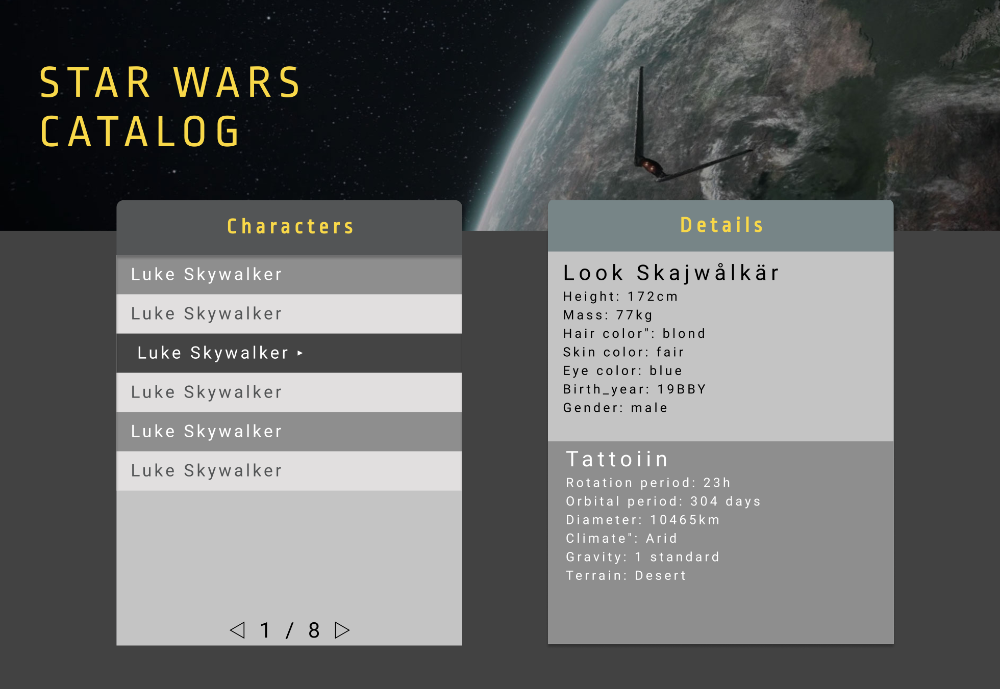

# Slutprojekt
## Star Wars Catalog

## Mockup
> [Star Wars Catalog Mockup PDF](star-wars-catalog-mockup.pdf)

## Webbtjänst
SWAPI: The Star Wars API
https://swapi.dev

## Beskrivning
Ni ska bygga en webbplats för en katalog över Star Wars karaktärer.

## Specifikation
* En lista på karaktärer som hämtas från https://swapi.dev
* Listan ska vara paginerad
* När man klickar på en karaktär i listan ska information om den karaktären visas i den andra boxen
* Medans en request håller på laddar ska en preloader visas i respektive låda
* Styling enligt mock, flasha med lite transitions

## Tekniker
* DOM-Interaktion och Manipulation
* Events
* Asynkron programmering och Promises
* Interaktion med webbtjänst
* De fem grundpelarna

## Level Up

### Ytterligare specifikation
Boxxen till höger ska ha 4 olika lägen som man kan växla mellan med tabbar(se mock).

Informationen i varje box behöver hämtas från olika Endpoints från swapi.dev.
